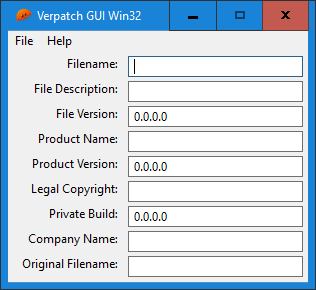

# Verpatch GUI Win32

A graphical user interface for [verpatch](https://www.codeproject.com/Articles/37133/Simple-Version-Resource-Tool-for-Windows), a program that allows modifying an executable's metadata (such as version info and copyright).

Made with [winsafe](https://github.com/rodrigocfd/winsafe).

## Preview

## Usage

1. Place [verpatch.exe](https://github.com/egorovsa/node-verpatch/tree/master/bin) inside this folder.

2. Run `cargo run`, or `cargo build --release` and find the resulting executable in the `target/release` folder.

## Customization

The file [resources.res](resources.res) can be edited with [Resource Hacker™](http://www.angusj.com/resourcehacker/).

## More

See more winsafe examples [here](https://github.com/rodrigocfd/winsafe-examples) (official) and [here](https://github.com/GirkovArpa/winsafe-7guis).

See this same program [here](https://github.com/GirkovArpa/verpatch-gui) made with [Sciter](https://sciter.com).